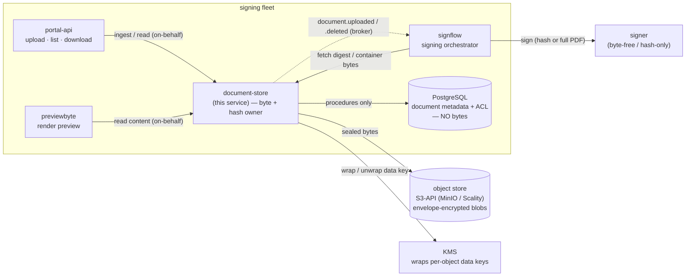
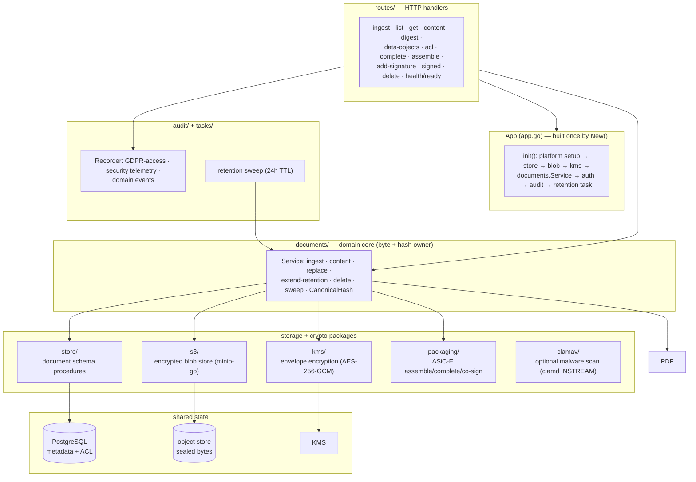
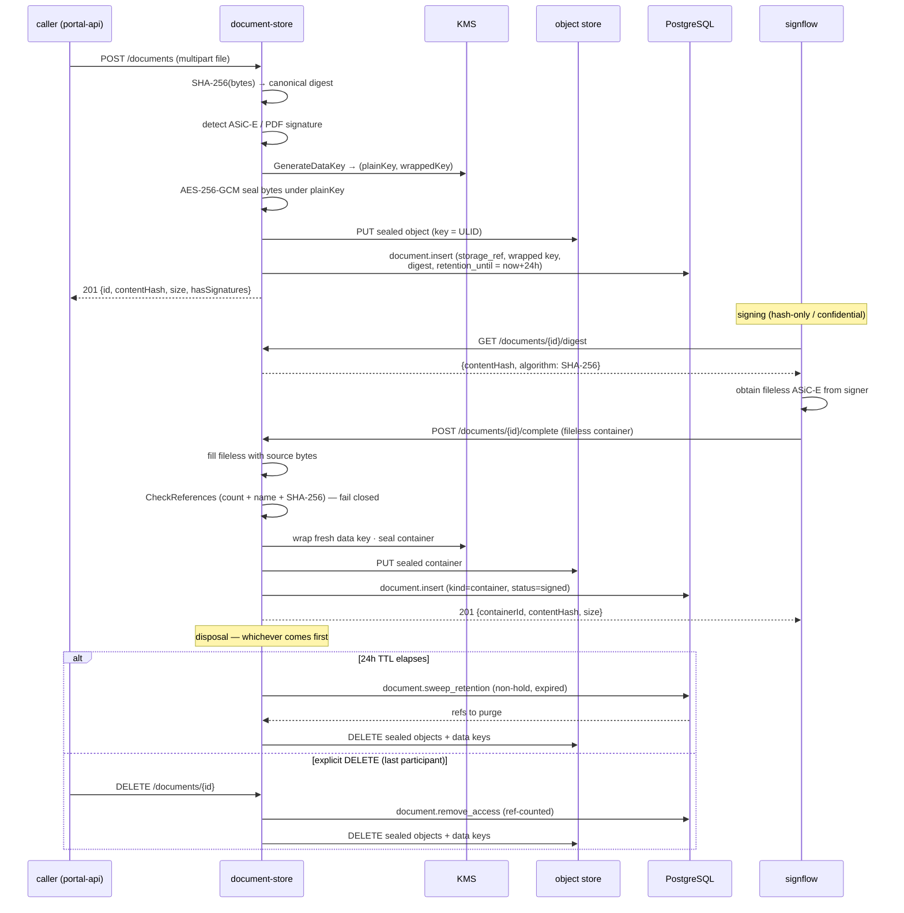

# document-store

The eSignature portal's **Document Service** — the platform's **single source of truth for document bytes and hashes**. It owns ingest, the canonical **SHA-256** digest (FIPS 180-4), envelope-encrypted object storage with a per-object KMS-wrapped data key, a 24-hour retention TTL with a background sweep, ASiC-E container assembly / completion (ETSI EN 319 162-1), and a signed-PDF (PAdES, ETSI EN 319 142-1) store guarded by a one-live-document-per-chain rule.

It is a **pure byte supplier**. It computes and stores the digest once at ingest and hands it out on request; it holds every byte encrypted at rest and returns decrypted bytes only to an authorized caller. It **does not sign** and **does not call the signer** — a separate orchestrating service fetches a digest (confidential hash-only signing) or the container bytes from here and drives the signer itself. It **does not run signature validation**: on assembly it self-checks the container's digest references locally (a pure-Go integrity check, no external validation service), but the cryptographic validation verdict belongs to the orchestrator.

On upload it also **detects an existing signature** — an already-signed PDF or an ASiC-E container — so the caller can decide whether the artifact still needs signing or should go straight to validation. Detection is structural, not a cryptographic verification.

Metadata lives in one PostgreSQL schema reached **only** through `SECURITY DEFINER` procedures under an `EXECUTE`-only database role; the service never touches a table directly, and **no document byte is ever written to the database**. Cross-cutting concerns (structured logging with redaction, OpenTelemetry tracing, correlation) are wired once by the shared platform toolkit — never per-service.

---

## Where it sits

`document-store` is one service in a small signing fleet. It is the only service that holds document bytes; every neighbour that needs bytes or a digest fetches them here over the authenticated API, under an on-behalf delegated token. It shares one PostgreSQL and one object store (S3-API: MinIO / Scality) with its siblings, and wraps per-object data keys through a KMS.



Division of labour, drawn at the **byte-ownership boundary**: `document-store` owns the bytes and the canonical hash and nothing else — no signing, no orchestration, no validation verdict. `signflow` orchestrates a signature: it fetches the digest (so the signer stays byte-free on the confidential path) or the completed container bytes, calls the signer, and owns the validation call. `portal-api` and `previewbyte` read bytes on behalf of a person. The signer never sees a whole document on the hash-only path — it sees a digest. The two sides meet only at this service's authenticated HTTP surface and at the domain-event broker.

---

## HTTP surface

Everything below `/api/v1` is behind DPoP service-token authentication (audience `svc:document`) and a `documents:<level>` scope check. Errors are RFC 9457 problem documents (`err:document:<reason>`). Liveness / readiness are unauthenticated and carry no error envelope.

| Method + path | Scope | Purpose |
|---|---|---|
| `POST /api/v1/documents` | `write` | **Ingest** (multipart `file`, optional `mime` / `preservation_class`): the **document gate** first (filename hygiene, size caps, structural checks on content that claims or appears to be PDF / ASiC-E — typed `422 err:document:malformedUpload` / `413` rejects; other formats stored opaque), an optional malware scan (`CLAMAV_ENDPOINT`), then canonical SHA-256 → envelope-encrypt → object store → persist a row with `retention_until = now + TTL`. An upload already carrying a signature is recorded as signed (`kind=pdf` / container) and reported via `hasSignatures`. Returns `{id, contentHash, mime, size, preservationClass, hasSignatures}`. This is the only gated route — the internal store-back routes receive platform-produced bytes. |
| `GET /api/v1/documents` | `read` | Caller-scoped listing, keyset-paginated (`?after=`, `?limit=`). `?view=chains` collapses it to **one live-head row per document chain** (the signed artifact where one exists, else the source — never both), paginated by chain root id; expired chains are omitted unless `?includeExpired=true`. |
| `GET /api/v1/documents/{id}` | `read` | One ACL-authorized metadata row (no bytes). |
| `GET /api/v1/documents/{id}/content` | `read` | **Decrypted bytes** (re-fetch / download). Emits a GDPR personal-data-access audit event per retrieval. While the chain's **result freeze** is set, a non-source row refuses with a typed 409 (`err:document:resultFrozen`) unless the caller declares a platform conduit purpose (`?conduit=signing\|render`) — refusal is the fail-closed default; sources always serve. |
| `GET /api/v1/documents/{id}/digest` | `read` | The canonical digest for signing (no bytes) — what the orchestrator fetches for hash-only signing. |
| `GET /api/v1/documents/{id}/data-objects` | `read` | An ASiC-E container's inner data objects (name + canonical SHA-256), for registering a parallel co-signature. `422` if not a container. |
| `GET /api/v1/documents/{id}/head` | `read` | A chain's **current live head** by root id — the signed artifact a co-signer must sign next (a signed PDF or a container). An uploaded already-signed document is its own root and head, so it resolves to itself; an empty id when no signed head exists yet (sign the unsigned source). Server-authoritative: a co-signer signs this, never a stale client-supplied id. |
| `GET /api/v1/documents/{id}/chain` | `read` | **One chain as its live head**, addressed by any id in it (root or head) — the projection a document screen states: signed-ness (`hasSignatures` / `platformSigned`), preservation class, retention, the download freeze, and the head container's inner files. Answers independently of the listing (which filters and pages), so a screen never has to find its document in a list. Distinct from `/head`, which answers what a co-signer must sign next. `404` when the chain has no live row left, or the caller is not on its ACL. |
| `POST /api/v1/documents/{id}/acl` | `grant` | Grant an invited eIDAS serial standing read + co-sign access to a document's chain (held only by the workflow service; no self-grant). Idempotent. |
| `POST /api/v1/documents/{id}/result-freeze` | `grant` | Set/clear the chain-level **download freeze**: the workflow service locks the signed result at send and lifts it at the workflow's terminal transition. Resolved to the chain root from any of its rows. Idempotent. |
| `GET /api/v1/documents/{id}/retention` | `grant` | **How long the chain's bytes stay downloadable** — the latest retention instant across the rows that still hold storage, plus how many there are (`liveRows: 0` means nothing is stored any more). Byte-free and owner-free: it answers a clock, never content or an identity. The workflow service reads it at its terminal transition, because retention rolls forward on every signing act and it cannot derive the instant itself. |
| `POST /api/v1/documents/{id}/complete` | `write` | Fill a **fileless ASiC-E** (multipart `container`) with the stored source bytes → self-check digest references → store + hash. The primary hash-only path. |
| `POST /api/v1/documents/assemble` | `write` | Build a container from uploaded `documents` + detached XAdES `signatures` (file-mode) → self-check references → store + hash. |
| `POST /api/v1/documents/bundle` | `write` | Package **one or more of the caller's unsigned sources into ONE unsigned ASiC-E** (the bundle — the universal at-rest form of a signing set, `status=received`) in the given order; the loose source rows are **absorbed** (deleted, blobs destroyed) in the same transaction. The bundle is the chain root; the first signature later merges in like a parallel co-signature. `422` when a document is not an unsigned owned source. |
| `POST /api/v1/documents/{id}/rebundle` | `write` | Rebuild an **unsigned** bundle in place (draft edit: add/remove/reorder) from `entries` (existing inner files by `name`, newly staged sources by `sourceId`) under the keep-latest CAS; refreshes the inner-file manifest, absorbs the new sources. `422` on a signed container. |
| `GET /api/v1/documents/{id}/data-objects/{name}` | `read` | **Extract one inner file** out of a container on demand (the absorbed originals' only home). Streams the bytes; records the GDPR access event like a content download. Returns only an inner original — never a signature or the assembled container — but the **result freeze** applies the same as a content read: while set, an undeclared caller refuses with `err:document:resultFrozen` (409) unless it declares a purpose (`?conduit=review\|render\|signing`); `review` is the user reviewing/re-staging an original. |
| `POST /api/v1/documents/{id}/add-signature` | `write` | Add a parallel (co-sign) signature to a stored container; keep-latest-replace in place; roll the chain's retention forward. |
| `POST /api/v1/documents/{id}/signed` | `write` | Store a finished, opaque signed document (multipart `signed`) — e.g. a PDF signed in place — verbatim against its chain. Not assembled or reference-checked; integrity is the embedded signature. The **form is checked** before storing, because the row is recorded as `kind=pdf` and everything downstream branches on it: bytes that are not PDF content are refused with `422 err:document:signedFormMismatch` (nothing stored, chain unchanged) and a high-severity `document.integrity_failure` security event. Form only — signature validity stays the signing service's answer. One live signed document per chain: when the target is itself a signed PDF (the current head, or an uploaded already-signed PDF acting as its own chain root) the result **keep-latest supersedes** it in place rather than adding a second; a fresh row is created only for the first signature on a plain source. |
| `POST /api/v1/documents/{id}/archived` | `write` | Replace a signed head's bytes IN PLACE with its archive-timestamped form (multipart `archived`) — the same document id, refreshed (B-LT → B-LTA). Works for both signed forms (container and signed PDF); CAS-guarded, so a concurrent co-sign wins (`409`); `422` for a plain source. |
| `GET /api/v1/history` | `read` | The caller's TERMINAL chains (every row expired/deleted — storage destroyed, record remaining): one row per chain as its terminal head, owner-scoped by the uploader subject, keyset-paginated. Records are erased by the history sweep after the keep window (`document_history_retention`, default 90 days). |
| `DELETE /api/v1/history/{chainRoot}` | `write` | Erase one owned history record early (hard delete of the terminal chain's metadata). `409` while the chain is live or under legal hold. |
| `DELETE /api/v1/documents/{id}` | `write` | Remove the caller's standing access; reference-counted — the chain's bytes + data keys are destroyed only when the last participant leaves. Refused under legal hold. |
| `GET /healthz` | — | Liveness: `200` whenever the process is up. |
| `GET /readyz` | — | Readiness: `200` when the metadata store and object store are reachable, else `503` naming the failing dependency. |

Scope levels: `read` covers metadata / content / digest / listing; `write` covers ingest / complete / assemble / add-signature / signed / delete; `grant` is the workflow service's chain-invitation right.

---

## Architecture

One application container (`App` in `app.go`) wires every dependency at startup: the metadata store, the encrypted byte store, the KMS, the domain service, inbound DPoP auth, the three audit regimes, the domain-event publisher, and the retention sweep task. Each backend has an interface seam with a production implementation and an in-memory development fallback — so the same binary runs against real PostgreSQL + S3 + KMS in the fleet, or fully in-process for tests with no Docker or network.



---

## Document lifecycle, end to end

Ingest of a source, its completion into a signed container by the orchestrator, and its eventual disposal — either by the 24-hour sweep or by an explicit delete. The digest is computed **once** at ingest and never recomputed; bytes are sealed before they leave the process and unsealed only for an authorized read.



---

## Containers and signing chains

Two signing shapes converge here, both leaving the service byte-authoritative:

- **XAdES / ASiC-E (hash-only, confidential).** The signer only ever sees a digest. It returns a *fileless* ASiC-E container (signatures + manifest, no data bytes). `complete` fills that container with the stored source bytes, and `assemble` builds one from uploaded documents + detached signatures. Either way the service self-checks the container's digest references — the signatures must reference exactly the supplied documents by count, filename, and SHA-256 — and stores the result. This check is pure-Go and does not call any validation service.
- **PAdES (signed PDF).** The signer returns a complete signed PDF; there is no container to assemble. `signed` stores it verbatim against its chain — its integrity is the embedded signature, checked later by the orchestrator's validation call, not here. What *is* checked here is the **form**: the stored row claims `kind=pdf`, so bytes that are not PDF content are refused rather than recorded under a form nothing verified.

A **chain** is a source document plus the signed artifacts derived from it. Concurrency is resolved with keep-latest semantics:

- **One container per chain.** If two parties begin from the same source and both try to create the chain's container, only one creation wins; the loser re-resolves the winner's container and co-signs into it, producing one shared multi-signature container rather than two divergent ones.
- **One live signed PDF per chain tree.** The uniqueness is keyed on the chain root, so an uploaded already-signed PDF (a signed root) and a signed child can never both be live. A second concurrent PDF creation surfaces as `409 chain-advanced`; the caller re-resolves the current signed PDF and signs on top of it (an embedded PDF signature cannot be merged after the fact).
- **Keep-latest replace** swaps a container's bytes in place under an optimistic compare-and-set on its current hash; a chain that advanced first yields `409`, for the caller to reload and retry.

---

## Byte storage and encryption

Document bytes never live in the database and are never stored in the clear. The service uses **envelope encryption**:

1. On each write it asks the KMS for a fresh **per-object data key** (32-byte AES-256) and its **KMS-wrapped** form.
2. It seals the bytes with the plaintext data key using **AES-256-GCM** (`nonce‖ciphertext`) and writes the sealed blob to the object store under an opaque **ULID** key (`storage_ref`).
3. It persists only the wrapped data key (`encryption_key_ref`) and the `storage_ref` on the metadata row. The plaintext data key never leaves memory and is discarded after use.

On read it fetches the sealed blob, unwraps the data key through the KMS, and opens the AES-GCM envelope. The blob store is content-agnostic — it stores ciphertext and never sees a plaintext byte or a key.

The KMS is an interface seam. The development provider is a **local** AES-256 master key (from `DOCUMENT_KMS_MASTER_KEY`, base64 of 32 bytes; an ephemeral key is generated if unset — dev only, since bytes become undecryptable after a restart). Production swaps in a managed KMS (e.g. Vault transit or a cloud KMS) behind the same interface, with no change to the storage layer.

Every stored object carries a **`retention_until`** set to `now + TTL` (24 hours by default). A background sweep destroys the sealed object and its data key once that instant passes (unless the row is under legal hold) and flips the row to `expired`. Bytes are minimised by default; durable retention is an explicit, per-document opt-in (the preservation class), not the norm.

---

## State and data model

**No document byte is ever persisted to PostgreSQL.** The database holds only metadata: the document rows, the per-chain access-control entries, and each container's inner-file manifest (name / media type / size — never the inner bytes).

Access is exclusively through the schema's `SECURITY DEFINER` procedures, called with a uniform JSONB request/response envelope; the service's database role has `EXECUTE`-only grants and cannot touch a table. A procedure that fails after a write re-raises a structured error the service maps back to a typed sentinel (`not_found` → 404, `legal_hold` → 409, `chain_advanced` → 409). Absence and no-access are deliberately indistinguishable (`not_found` for both) so a caller cannot probe for documents it may not see.

| Procedure | Role |
|---|---|
| `document.insert` | Persist a metadata row (source or container) and return its ULID id |
| `document.get` · `document.list` | ACL-authorized read of one row / a keyset page |
| `document.list_chains` · `document.get_chain` · `document.list_history` | The chain projection — a keyset page of live chains, ONE chain by any id in it, and the terminal-chain history. All three read the same derivation of a chain's facts, so they cannot disagree about whether a document is signed |
| `document.get_container_by_parent` · `document.get_latest_signed_pdf_by_chain` | Re-resolve a chain's current container / signed PDF (race recovery) |
| `document.replace_container_blob` | Keep-latest in-place byte swap under an optimistic CAS |
| `document.grant_acl` · `document.remove_access` | Grant / reference-counted revoke of chain access |
| `document.extend_retention` · `document.set_preservation_class` · `document.set_status` | Roll retention forward / set class / set status |
| `document.sweep_retention` | Flip expired non-hold rows to `expired` and return the byte refs to purge |

A document row records `owner`, `kind` (`source` / `container` / `pdf`), the chain `parent_id`, the canonical `content_hash`, `mime`, `size`, `status`, `preservation_class`, `retention_until`, `legal_hold`, and the internal `storage_ref` / `encryption_key_ref` (both nulled once bytes are purged). The two byte-location refs are never exposed on the API projection.

An access entry binds a **chain** to a principal — the owner by token subject, or an invited co-signer by their normalized **eIDAS serial** (identity code), which is carried through on-behalf delegation so a co-signer matches their invited slot. This is how a person invited to co-sign gains read + co-sign access without being the document's owner.

---

## Configuration

Standard fleet env (`SERVER_URLS`, `SERVICE_NAME`, `ENVIRONMENT`, `LOG_*`, `METRICS_ENABLED`, `OTEL_*`, `BROKER_URL`) comes from the shared base configuration, plus:

| Env var | Default | Meaning |
|---|---|---|
| `AUTH_ISSUER_URL` / `AUTH_JWKS_URL` | — | Inbound DPoP token validation (issuer + JWKS) |
| `SERVICE_AUDIENCE` | — | Expected token audience (`svc:document`) |
| `DOCUMENT_STORE_DSN` | — | PostgreSQL DSN for the `EXECUTE`-only role. Unset ⇒ in-memory metadata store (development only). Supports the `_FILE` secret convention. Pool size comes from the DSN itself — `pool_max_conns` (pgx reads it and strips it before Postgres sees it; its default is the host's CPU count): set it explicitly to the deployment's connection budget, e.g. `?sslmode=…&pool_max_conns=4&pool_min_conns=1`. |
| `MAX_FILE_BYTES` | `26214400` (25 MiB) | Per-file upload cap (checked before read) |
| `DOCUMENT_RETENTION_TTL` | `24h` | Retention window applied at ingest |
| `DOCUMENT_RETENTION_SWEEP_INTERVAL` | `15m` | Retention sweep cadence |
| `DOCUMENT_RETENTION_SWEEP_BATCH` | `500` | Rows purged per sweep batch |
| `DOCUMENT_HISTORY_RETENTION` | `2160h` (90 days) | How long a terminal chain's metadata record stays readable as history after its bytes are destroyed; the sweep erases older records (data minimisation). **`0` disables the erasure**, so history is kept indefinitely — a deliberate choice, not a safe default |
| `S3_ENDPOINT` / `S3_ACCESS_KEY` / `S3_SECRET_KEY` / `S3_USE_SSL` / `S3_BUCKET` / `S3_PREFIX` | — | S3-API blob store. `S3_ENDPOINT` + `S3_BUCKET` unset ⇒ in-memory blob store (development only). `S3_SECRET_KEY` supports the `_FILE` convention |
| `DOCUMENT_KMS_MASTER_KEY` | — | base64 32-byte AES-256 master key (dev local KMS). Unset ⇒ ephemeral dev key. Supports the `_FILE` convention |
| `SERVICE_CLIENT_ID` / `SERVICE_CLIENT_SECRET` | `svc:document` / — | Outbound DPoP service-client identity (the audit poster). `SERVICE_CLIENT_SECRET` supports the `_FILE` convention |
| `AUDIT_ISSUER_URL` | — | In-network token-mint address for outbound calls (the `iss` stays `AUTH_ISSUER_URL`) |
| `ACCESS_AUDIT_URL` / `ACCESS_AUDIT_AUDIENCE` / `ACCESS_AUDIT_SCOPE` | — / `svc:access-audit` / `access-audit:write` | GDPR personal-data-access audit sink; off until the URL is set |
| `ACCESS_AUDIT_OUTBOX_DIR` | — | Optional durable outbox directory for audit records |
| `CLAMAV_ENDPOINT` | — | Optional clamd `host:port` for a malware scan on user-facing uploads (INSTREAM, after the document gate; `422 err:document:infectedUpload` on FOUND). Unset ⇒ the scan is skipped entirely; an unreachable scanner fails open with a warning |
| `DOCUMENT_EVENTS_TOPIC` | `document.events` | Broker topic for `document.uploaded` / `document.deleted` domain events |

Secrets follow the `_FILE` convention: a `<NAME>_FILE` (or mounted secret) is loaded as a default that an explicit env value still overrides.

---

## Audit and events

The service participates in three regimes and produces none of the signing chain itself:

- **GDPR personal-data access** — one record per decrypted-bytes retrieval (`/content`), with the authenticated caller as actor and the document owner (a pseudonymous internal subject, never a national id) as data subject. Optional; wired only when the access-audit sink is configured. Fail-open — an audit back-pressure never breaks a read.
- **Security telemetry** — authorization denials, cap-exceeded, IDOR attempts, integrity failures, ingest / delete outcomes, and retention sweeps.
- **Document domain events** — `document.uploaded` / `document.deleted` published to the broker (or a dev log transport when no broker is set). These are lifecycle signals; the orchestrator is the component that lands material events on the durable signing-audit chain — this service never writes it directly. The event payload carries a digest, never content.

---

## Directory layout

```
document-store/
├── app.go / config.go        — App container + configuration (backends, TTL, auth, audit)
├── auditposter.go            — outbound DPoP service token → access-audit poster
├── logtransport.go           — dev log broker transport (no BROKER_URL)
├── testing.go                — in-process test harness
├── cmd/server/               — CLI entrypoint (web default + health subcommand)
├── routes/                   — HTTP handlers + request/response DTOs
├── documents/                — domain core: ingest · content · digest · replace · delete · sweep · CanonicalHash
├── store/                    — document-schema procedure calls (postgres.go) + in-memory backend (memory.go)
├── s3/                       — encrypted-byte object store (minio-go) + in-memory backend
├── kms/                      — envelope encryption (AES-256-GCM; local dev provider)
├── packaging/                — ASiC-E assemble / complete / co-sign + reference self-check
├── pdfsig/                   — structural PDF-signature detection
├── audit/                    — GDPR-access · security telemetry · domain events + audit drain task
└── tasks/                    — 24h-TTL retention sweep
```

---

## Development

Standard Go module (`github.com/signbyte/document-store`, Go 1.26). Every dependency, including the `gmb-lib/*` modules, is public and fetched from the network at its pinned tag — no local `replace`, no vendoring, and nothing that needs credentials or a `GOPRIVATE` setting.

```bash
go mod tidy
go build ./...
go vet ./...
go test ./...
gofmt -l .
```

The unit suite runs entirely against in-process fakes — an in-memory metadata store, an in-memory blob store, and the local KMS — so no Docker, database, or object store is needed. Point `DOCUMENT_STORE_DSN` + the `S3_*` env at real backends to exercise the production paths.

One test is heavier: `documents/integration_test.go` drives the domain core against a **live** PostgreSQL and object store with real envelope encryption. It sits behind the `integration` build tag so `go test ./...` stays hermetic, and it is run by hand once the backends are up (the file header lists the exact env):

```bash
go test -tags integration -run TestPhaseB ./documents/...
```

Continuous integration does not run it (there is no live infrastructure there) but does **compile and lint** it — `go vet -tags integration ./...` — so it cannot rot unnoticed behind the tag.

The container image is a two-stage build (`CGO_ENABLED=0`) onto a minimal rootless scratch base (`ghcr.io/wntrtech/scratch`, non-root `app` user, CA certs + tzdata), listening on port `8080`, with a `HEALTHCHECK` that runs the binary's `health` subcommand:

```bash
docker build -t document-store .
```

Apply the `document` schema migrations against PostgreSQL before running with a `DOCUMENT_STORE_DSN`.

---

## Security invariants

- **Bytes never in the database, never in the clear at rest.** Document bytes live only in the object store, sealed with AES-256-GCM under a per-object, KMS-wrapped data key; the plaintext data key never persists.
- **Bytes never in a log, trace, metric, or error message.** Domain events and audit records carry a digest and metadata, never content; unmapped errors are logged server-side and returned as a fixed problem code.
- **On-behalf access only.** Every content read is an authenticated, scope-checked, ACL-authorized call, audited as a personal-data access; access is bound by token subject or invited eIDAS serial, DB-enforced (no-IDOR — absence and no-access are indistinguishable).
- **Least-privilege data plane.** The database role is `EXECUTE`-only on `SECURITY DEFINER` procedures and cannot read or write a table.
- **Fail closed on integrity.** Container assembly self-checks digest references (count + filename + SHA-256) before storing; a mismatch is rejected, not stored.
- **Downloads can never run as a script.** A document can be any file type a user wants signed, so every raw-bytes download (`content`, `data-objects/{name}`) sets `Content-Disposition: attachment` + `X-Content-Type-Options: nosniff` and coerces browser-active content types (HTML/XHTML/SVG/XML) to `application/octet-stream` — the stored bytes are untouched, only the outbound header/type changes.
- **Minimised by default.** Every object carries a 24-hour TTL and is destroyed by the sweep (bytes + data key) unless explicitly held; durable retention is an opt-in preservation class.
- **The dev concessions are loud and off in production** — the in-memory backends, the ephemeral KMS key, and the user-token acceptance each warn at startup and are never the production configuration.

---

## Known limitations

- **After-TTL / confidential re-validation needs the full container.** Validation of a stored container is the orchestrator's call and requires the container bytes; once the 24-hour TTL has purged them, re-validation is unavailable until a byte-free validation path exists.
- **eIDAS serial normalization is minimal.** ACL matching trims and upper-cases the identity code; fuller cross-border normalization is a planned extension behind the existing seam.
- **Whole files are buffered in memory.** Ingest, completion, and reads read the full artifact into memory (bounded by `MAX_FILE_BYTES`); there is no streaming path yet, so the file-size cap is also the effective per-request memory bound.
- **Signature detection is structural, not cryptographic.** On upload the service reports that a signature *exists* (a PDF signature dictionary, or an ASiC-E manifest / signature), never that it is *valid* — validity is the orchestrator's verdict.
---

## Contributing

Bug reports and pull requests are welcome. [CONTRIBUTING.md](CONTRIBUTING.md) names the gate a
change has to pass, the invariants a change must not weaken, and the sign-off every commit carries.

Suspected vulnerabilities go through the private route in [SECURITY.md](SECURITY.md) — never a
public issue. This service holds every document byte in the platform, so that file also says which
failures we treat as most serious.

## Licence

**GNU Affero General Public License, version 3 only** — see [LICENSE](LICENSE).

This is a network service, so the clause worth knowing is the one MIT and GPL do not have: if you
run a modified version and let others interact with it over a network, you must offer those users
the corresponding source of your modified version. Running it unmodified, or modifying it for
internal use with no network users, does not trigger that.
